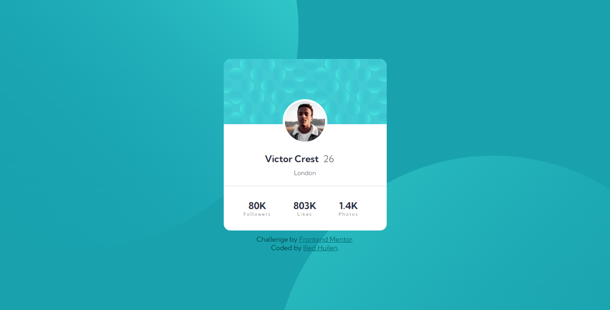
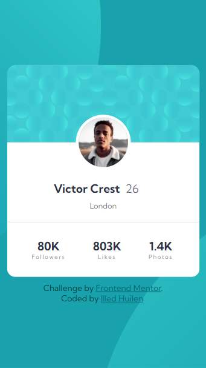

# Frontend Mentor - Profile card component

## Table of contents

- [Overview](#overview)
  - [Screenshot](#screenshot)
  - [Links](#links)
  - [Built with](#built-with)
  - [Continued development](#continued-development)
  - [Useful resources](#useful-resources)
- [Author](#author)
- [Acknowledgments](#acknowledgments)

**Note: Delete this note and update the table of contents based on what sections you keep.**

## Overview

This is a solution to the [Profile card component](https://www.frontendmentor.io/challenges/profile-card-component-cfArpWshJ/hub).

### Screenshot

### Links

- Solution URL: [Solution Repository](https://github.com/IlledNacu/Challenge-4-FrontendMentor)
- Live Site: [Live Site](https://illednacu.github.io/Challenge-4-FrontendMentor/)

### Built with

- Semantic HTML5 markup
- CSS custom properties
- Flexbox

### Continued development

The areas that I want to continue focusing on in future projects are flex and responsive.

### Useful resources

- [mdn web docs](https://developer.mozilla.org/)
- [W3Schools](https://www.w3schools.com/)

## Author

- GitHub - [Illed H. Nacucchio](https://github.com/IlledNacu)
- Frontend Mentor - [@IlledNacu](https://www.frontendmentor.io/profile/IlledNacu)
- Instagram - [@illed.nacu](https://www.instagram.com/illed.nacu/)

## Acknowledgments

Thanks to Hernan, my professor from UNDAV's course, "Jr. Programmer", second stage of Argentina Programa 4.0
